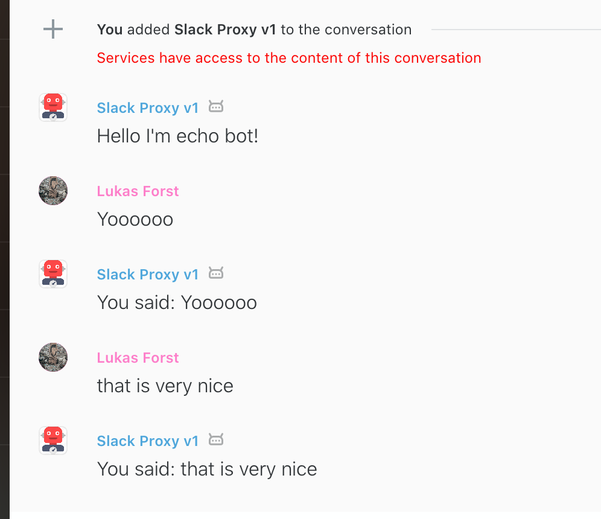

# Charon
## The bridge between Slack and Wire

Charon is proxy converting Slack Bot API calls to Wire (using [Roman](https://github.com/dkovacevic/roman)) and back.

It uses `pipenv` for dependencies management. 
Currently build on top of:
- [Flask](https://github.com/pallets/flask)
- [flask-restx](https://github.com/python-restx/flask-restx)
- [requests](https://github.com/psf/requests)

## Running the proxy
Please create file `config.py` which contains following runtime variables:
```python
ROMAN_URL = '<Roman URL>'
```

## Workflow
1) register Slack Bot in the register endpoint, please note that `to_bot_token` is token provided by Roman.
2) change bot's base URL to target this service `/slack`

## Missing 
Almost everything... this is just a PoC project which was tested only on Echo Bot,
which sends everything back.
But it works!
