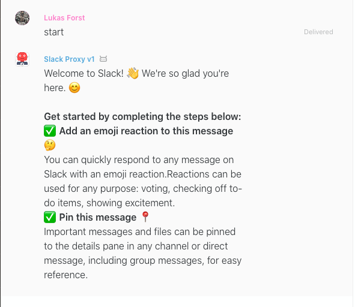

# Charon
[](https://badge.fury.io/gh/wireapp%2Fcharon)


## Bridge between Slack and Wire
Charon is proxy converting Slack Bot API calls to Wire (using [Roman](https://github.com/dkovacevic/roman)) and back
and thus allows to use subset of Slack Bots in the Wire. 

Please note that this is simple proof of concept work, that was developed in few days just to prove that it is possible
to use existing Slack Bot and connect it to the [Wire](https://wire.com) API.
The code looks accordingly.

## How does Charon work
It exposes Slack-like API which is called by the Slack Bot.
Then it transforms the API call to one that can be processed by [Roman](https://github.com/dkovacevic/roman).
The very same thing happens when new message is received from the Roman,
the message is transformed (some information are missing in the default calls from the Roman, so the proxy ask for them)
 to the Slack version of message and sent to the Slack Bot API.
 
 > Is it slow?
 
 Not really, it is slower than running native [Lithium](https://github.com/wireapp/lithium),
 but when I was testing raw Slack Bot with Slack API, the response time was between 1.4 and 2.5 seconds.
 The setup with Charon and Roman had response times around 1.2 and 2.5 seconds, so no leg basically. 

## Security & Privacy
Please note that the requests from the bots and the bots **communication** through Charon & Roman
is **not end-to-end encrypted**. 
Whole idea of using Charon & Roman is to provide most simple way how to send data to the Wire environment
and therefore all encryption is leveraged to the Roman.
In other words, requests sent to the Charon are not encrypted, Charon sends them to Roman,
 then Roman encrypts them (Roman uses [Lithium](https://github.com/wireapp/lithium)) and send them to Wire backend. 

However, Charon does not store content of conversations in the database
(but when debug log level is enabled, part of the messages can be printed to logs).
The only data, that are stored, are access keys to Roman and to Slack bot.
All database related operation can be found in [Repository](services/Repository.py).

If the e2e encryption is necessary, one can either deploy Roman and Charon to one's infrastructure 
or to use directly [Lithium](https://github.com/wireapp/lithium).

## Slack bot onboarding
To add new Slack bot instance to Charon one must register the bot in the Roman and in the Charon.
Both services have Swagger API for registration process or one can use CLI 
from the [repository with example](https://github.com/LukasForst/slack-onboarding-bot/tree/master/cli). 

Charon have support for Slack webhook API as well as event API,
therefore the bot can either just post messages via webhook API or have complete access to communication 
with event API.

### Webhook API
One must register the bot in Roman and then on `/registration/hook` endpoint in the Charon.
Due to Wire security limitations, webhook links are generated when the bot is added to the conversation.
Therefore in order to get the webhook link, one must add the bot to the conversation, 
where should be the bot posting the messages. 
After adding the bot to the conversation, you will receive generated link for that specific conversation.

Minimal working example is:
```bash
curl -X POST http://charon.wire.com/slack/webhook/<api-key-per-bot>/<generated-conversation-id>  \
    --header "content-type: application/json" \ 
    --data '{"text": "hello world"}'
```

For registering new bot, one can use [CLI](https://github.com/wireapp/charon-webhook-cli).

## Example
Example bot with complete CLI and description can be found [here](https://github.com/LukasForst/slack-onboarding-bot).
It is based on the official [tutorial](https://github.com/slackapi/python-slackclient/tree/master/tutorial),
where we changed just the backend URL (from Slack to Charon).
In that repo, there's also CLI, which allows to run the bot targeting Slacks API or Wire with single command.
```bash
make run-wire
```
To target Wire or to target Slack:
```
make run-slack
```

## Known issues 
This is just a PoC project, to show that it is indeed possible to partially map Slack API 
and to use Slack bots in the Wire infrastructure. 
However, there are some limitations and therefore mapping between API can't be 1:1.

Known limitations so far:
* Wire does not have concept of Slack's `channel`
    * channels are in Slack public and all bots can read from them even though they are not part of that channel,
    Wire does not have concept of public channels as public channels couldn't be encrypted
    * Charon therefore maps `channel` to `group`, where group is Slack's concept of private conversations
* Wire does not support commands
    * Slack has special type of the message which is called `command` that is basically `/do something`
    * This can be implemented in Charon in the future by simply parsing incoming message from the Roman
    and if it starts with `/`, Charon would transform that into the `command` message.
* Bot can not initiate conversation
    * In the Slack, bot can create conversation with anyone, 
    Wire does not allow conversations initiated by bot for security reasons.
* Various events
    * Wire does not support messages pins yet
    * Wire has only hearth reaction, so no other emojis can be used for reactions.
    * In general, vast majority of events from Slack are not, or even couldn't be, mapped to Wire events
    as Wire tries to limit the API and events because of security.
    However, that shouldn't be problem in the future, because bot should react only to events that we want it to react,
    therefore we are able to simulate almost anything. 

There are, for sure, more limitation then those listed here, but we haven't found out yet.

## Running Charon
Charon needs following configuration - `ROMAN_URL`, `REDIS_URL`, `REDIS_PORT`, `REDIS_USERNAME`, `REDIS_PASSWORD`
 and `CHARON_URL`.
To run Charon locally, please create file `config.py` which contains following runtime variables:
```python
ROMAN_URL = 'http://proxy.services.zinfra.io'

REDIS_URL = 'localhost'
REDIS_PORT = '6379'
REDIS_USERNAME = ''
REDIS_PASSWORD = ''

CHARON_URL = 'http://localhost:8080'
```
and spin the Redis instance - there's one in the docker-compose.
To run Charon inside docker-compose, just execute `docker-compose up`.

#### Configuration
* `CHARON_URL` - is URL under which is Charon visible from public internet, 
it is used to generate unique URLs for the webhook only bots

## Docker Images
Charon has public [docker image](https://hub.docker.com/r/lukaswire/charon).
```bash
lukaswire/charon
```
Tag `latest` is current master branch - each commit is build and tagged as `latest`.
[Releases](https://github.com/wireapp/charon/releases) have then images with corresponding tag.

## Development
Master branch is used as bleeding edge which is deployed as `latest` to staging environment.
Stable releases are tagged and deployed to production.
Significant or notable changes that would break current behavior are developed in separate branches
and merged to master through the PR. 
Squashing is not necessary.

Charon uses `pipenv` for dependencies management. 
Currently build on top of:
- [Flask](https://github.com/pallets/flask) - development server and facade
- [gunicorn](https://github.com/benoitc/gunicorn) - production server
- [flask-restx](https://github.com/python-restx/flask-restx) - requests processing, swagger
- [requests](https://github.com/psf/requests) - sending HTTP requests to Roman/Bot
- [emoji](https://github.com/carpedm20/emoji/) - emoji processing (from Slack to Wire)
- [redis](https://github.com/andymccurdy/redis-py) - storage for information about bots and services
- [dacite](https://github.com/konradhalas/dacite) - simple Dataclass parsing from JSON

## Releases
See [releases page](https://github.com/wireapp/charon/releases) for more info.

* Since [0.1.0](https://github.com/wireapp/charon/tree/0.1.0) Charon supports [Slack Webhook API](https://github.com/wireapp/charon#webhook-api).
* In [0.0.2](https://github.com/wireapp/charon/tree/0.0.2) we added support for the blocks, emojis 
and run the official welcome slack bot from the [tutorial](https://github.com/slackapi/python-slackclient/tree/master/tutorial)
through the proxy.


